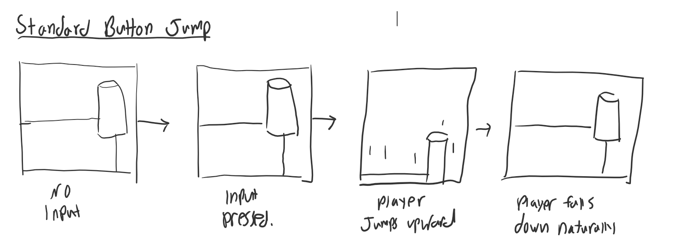
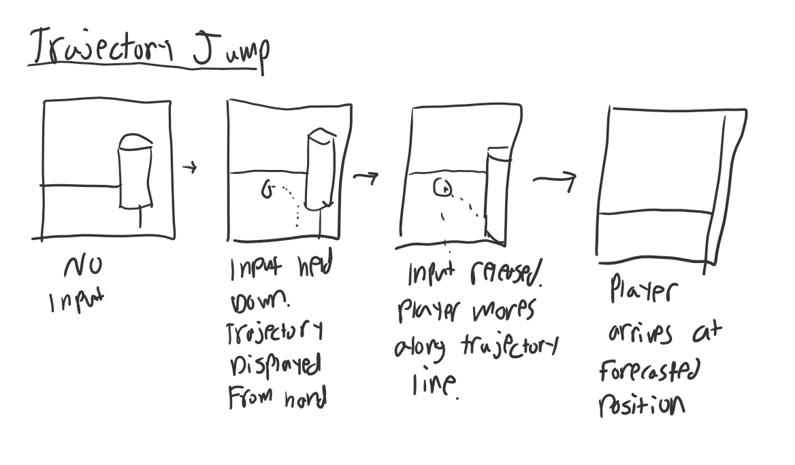
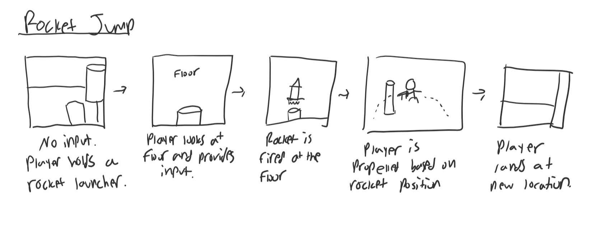

# JUMPING!!! JUMPING ALL THE TIME!!!
## Jamison Wilder

__Interaction Description__
The tested interaction for this brief project will be jumping in a 3-dimensional VR space. There will be 3 versions of jumping implemented:
- The player presses a button on the handset. Once this button is pressed, the player performs a small jump in the virtual space
- The player presses and holds a trigger on the handset. While holding the trigger, a trajectory line appears in the virtual space indicating a jump trajectory. Once the trigger is released, a jump will be performed following that trajectory.
- The player presses a trigger to shoot out an explosive projectile. Upon shooting this projectile at their own feet, they will be propelled in the opposite direction according to the Unity physics engine.

__Storyboards__

## Experiment write-up
Across the 7 test users for my VR experiment, several interesting common threads were found amongst their responses. The questions posed before the experiment were:
- Have you had any experience with jumping in vr before?
-  What do you think could be some creative ways of implementing jumping?
-  What does a well-designed "jump" feel like in a virtual experience?
- And the questions posed after the experiment were
- Was there an interaction that you found easiest to figure out?
-  Did you find the experience disorienting at all?
-  How might you suggest making any of the interactions more fun or intuitive?

The commonalities between responses were striking–several participants suggested launch pads and trampolines when posed the second pre-experiment question, and several suggested a movement that involved a “swinging” motion. As for the well-designed jump question, one participant brought up the importance of control in jumping, as the user should know where they are going to not feel disoriented; unsurprisingly, that same participant found the trajectory jump to be the most intuitive. Amongst other suggestions for interactions were grappling hooks, thrusters, and variable surfaces.
During the experiment, every participant expressed a natural enjoyment of the mechanics, particularly the rocket jumping one. One participant expressed satisfaction at the idea of combining the interactions together to move in more interesting ways. The instructions were unclear for the button interaction, since many users did not know which button the ‘X’ button was, but otherwise their experiences seemed fluid and enjoyable.

After the experiment, there was a wide swath of responses for which interaction was most intuitive, but most participants seemed to not feel disoriented during the experience. One participant gave valuable feedback pertaining to falling in VR, and how that feeling can be incredibly nauseating. They suggested adding a player model, increasing the height of the camera, and adjusting the fall speed to mitigate this feeling. There were also various indicators that the control and precision of the jumps could be improved–the default jump does not move the player straight up, and the trajectory jump isn’t accurate enough to parkour on the map’s platforms. Another common suggestion was the addition of sound effects to add more haptics into the experience for more immersion.
As a whole, my main takeaways can be bulleted like the following:

- Interactions should be more precise, and should give users more control/autonomy over their movement
- Small adjustments can be made to increase haptic feedback, resulting in a less disorienting and more immersive experience
- Explain the ‘X’ button instruction more clearly
- There are several other interesting yet natural ways to implement jumping, such as grappling hooks, swinging, and jump pads.
